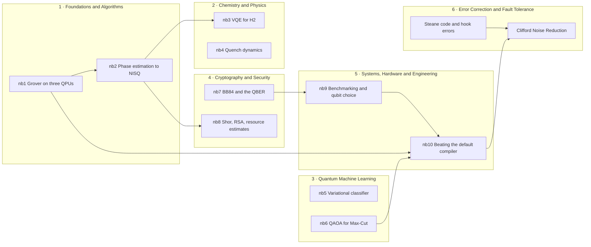

# qBraid QUEST

**Quantum University Education & Support Track**

Hands-on quantum computing material that runs on real quantum processors.

QUEST gives university courses free access to the qBraid platform: 25+ QPUs from multiple
vendors behind one interface, and a hosted notebook environment with nothing to install.
This repository is the teaching material that comes with it: ten notebooks written for the
program, a set of qBraid tutorial series, and a curated map of the best openly available
material from across the field.

Every notebook runs a real algorithm on real hardware and measures the distance between the
textbook answer and what the device actually returns. That distance is the lesson.

---

## Start here

| If you are teaching or taking… | Go to | Open first |
|---|---|---|
| Introduction to quantum computing, QIS | [Foundations and Algorithms](#1-foundations-and-algorithms) | nb1 · Grover |
| Quantum algorithms | [Foundations and Algorithms](#1-foundations-and-algorithms) | nb2 · Phase estimation |
| Quantum chemistry, quantum simulation | [Chemistry and Physics](#2-chemistry-and-physics) | nb3 · VQE for H₂ |
| Many-body or condensed matter physics | [Chemistry and Physics](#2-chemistry-and-physics) | nb4 · Quench dynamics |
| Quantum machine learning | [Quantum Machine Learning](#3-quantum-machine-learning) | nb5 · Variational classifier |
| Combinatorial optimization | [Quantum Machine Learning](#3-quantum-machine-learning) | nb6 · QAOA |
| Quantum cryptography, PQC, security | [Cryptography and Security](#4-cryptography-and-security) | nb7 · BB84 |
| Hardware, devices, architecture | [Systems, Hardware and Engineering](#5-systems-hardware-and-engineering) | nb9 · Benchmarking |
| Error correction, fault tolerance | [Error Correction and Fault Tolerance](#6-error-correction-and-fault-tolerance) | Steane code and hook errors |

**Just want to see one?** [nb1 · Grover's search on three QPUs](notebooks/quest_nb1_grover_three_qpus.ipynb)
is the shortest path to the idea behind all of them.

---

## Running it

**On qBraid.** Nothing to install. Open a notebook, select the `Python 3 [Default]` kernel,
and run. Simulator cells are free; hardware cells use credits, which QUEST courses receive
as part of the program.

**Locally.**

```bash
git clone --recurse-submodules https://github.com/qBraid/qBraid-QUEST.git
cd qBraid-QUEST
pip install -r requirements/core.txt
```

That covers nine of the ten notebooks. Only
[nb3](notebooks/quest_nb3_vqe_h2_full_pipeline.ipynb) needs more:

```bash
pip install -r requirements/chem.txt
```

`chem.txt` includes everything in `core.txt` and adds the classical chemistry stack on top.
Note that `openfermionpyscf` is a separate package from `openfermion` and is easy to miss.

Tested against qiskit 2.5.2, qiskit-aer 0.17.2, qbraid 0.12.2.

---

## How the material connects

Arrows mean one piece genuinely builds on another. Within an area, work in the order shown.



---

## The six areas

Each area is a path. Numbered rows are the recommended order; `+` rows are companion
material you can take at any point.

### 1. Foundations and Algorithms

*Introductory and intermediate courses in quantum computing and quantum information.*

| | Material | |
|---|---|---|
| **1** | [**nb1** · Grover's search on three QPUs](notebooks/quest_nb1_grover_three_qpus.ipynb) | The same circuit becomes three different circuits on three vendors. Transpiled depth predicts the outcome better than the query count does. |
| **2** | [**nb2** · Phase estimation, textbook to NISQ](notebooks/quest_nb2_qpe_textbook_to_nisq.ipynb) | QPE with zero-noise extrapolation. The engine inside Shor's algorithm and quantum chemistry, so it feeds two later areas. |
| **+** | [IEEE QCE23 workshop](tutorials/IEEE_QCE23_qBraid_Tutorial) | Two sessions with exercises *and worked solutions*. The closest thing here to a drop-in lab sequence. |
| **+** | [qBraid Lab demos](qbraid-lab-demo) | The platform itself: runtime, job submission, and reaching Bloqade, Pasqal, AWS and IBM devices through one interface. |

**Further reading**

- **[IBM · Basics of quantum information](https://quantum.cloud.ibm.com/learning/en/courses/basics-of-quantum-information)** — *Intro.* States, measurement, circuits, entanglement. The cleanest free treatment of the formalism.
- **[IBM · Fundamentals of quantum algorithms](https://quantum.cloud.ibm.com/learning/en/courses/fundamentals-of-quantum-algorithms)** — *Intermediate.* Where quantum algorithms beat classical ones. The natural companion to nb1 and nb2.
- **[PennyLane Codebook](https://pennylane.ai/codebook/introduction-to-quantum-computing)** — *Intro.* Codercises rather than reading, entirely in the browser. Best option when students have no working Python environment. See also the [Foundations learning path](https://pennylane.ai/codebook/learning-paths/foundations-of-quantum-computing).
- **[PennyLane · Intro to QSVT](https://pennylane.ai/demos/tutorial_intro_qsvt)** — *Intermediate to Advanced.* Quantum singular value transformation: the construction that puts Grover, amplitude amplification, Hamiltonian simulation and matrix inversion under one roof. Increasingly how modern algorithms are presented. See also [QSVT on hardware](https://pennylane.ai/qml/demos/tutorial_qsvt_hardware).
- **[Wong, *Introduction to Classical and Quantum Computing*](https://www.thomaswong.net/introduction-to-classical-and-quantum-computing.pdf)** — *Intro.* Free PDF, assumes only trigonometry and builds the linear algebra it needs.
- **[de Wolf, *Lecture Notes*](https://arxiv.org/abs/1907.09415)** — *Intermediate to Advanced.* The best free text for a theory-leaning course; the Grover and Shor chapters are assignable as-is.
- **[Preskill, Ph219/CS219](https://www.preskill.caltech.edu/ph219/)** — *Advanced.* The standard graduate reference.
- **[Qiskit Global Summer School](https://www.youtube.com/playlist?list=PLOFEBzvs-Vvo5o97bYt8o1l8Ra1poMASQ)** — *Intermediate.* Recorded lectures by working researchers; a useful second voice on hard topics.
- **[IonQ · Introduction to Quantum Programming](https://ionq.com/resources/anthology/lecture-series-introduction-to-quantum-programming)** — *Intro.* Four-part lecture series from IonQ scientists; their [resource center](https://ionq.com/resources) also carries a series on how trapped ions actually compute.

### 2. Chemistry and Physics

*Quantum simulation, computational chemistry, many-body and condensed matter physics.*

| | Material | |
|---|---|---|
| **1** | [**nb3** · VQE for H₂, molecule to ground state](notebooks/quest_nb3_vqe_h2_full_pipeline.ipynb) | The full pipeline: PySCF integrals, Jordan-Wigner mapping, hardware-efficient ansatz, potential energy surface against full CI. Most tutorials hand you a Hamiltonian and skip the chemistry. |
| **2** | [**nb4** · Quench dynamics of the transverse-field Ising model](notebooks/quest_nb4_tfim_quench_dynamics.ipynb) | Trotterised evolution against exact diagonalisation. A real many-body calculation of the kind that appears in current research. |
| **+** | [IEEE QCE25 · Quantum chemistry on quantum computers](tutorials/IEEE_QCE25_QC_on_QC_Tutorial) | A two-session tutorial: fermion-to-qubit mappings first, then VQE with graded exercises, closing on active research directions and the role of noise. Works well *before* nb3, or after it as reinforcement. |
| **+** | [Generalized Superfast Encoding](tutorials/Generalized-Superfast-Encoding) | A mapping that beats Jordan-Wigner on operator weight and doubles as a stabilizer code — a bridge into area 6. |
| **+** | [Q-Cliff](tutorials/Q-Cliff) | Clifford-frame ansatz builder with worked VQE for LiH and H₄. Extends nb3's ansatz discussion directly. |

**Further reading**

- **[PennyLane · quantum chemistry demos](https://pennylane.ai/search/?contentType=DEMO&categories=quantum%20chemistry)** — *Intermediate.* The deepest free collection in this area; the differentiable approach contrasts usefully with nb3.
- **[QuTiP tutorials](https://qutip.org/qutip-tutorials/)** — *Intermediate to Advanced.* Open quantum systems and master equations — the dissipative side nb4 deliberately leaves out.
- **[McArdle et al., *Quantum computational chemistry*](https://arxiv.org/abs/1808.10402)** — *Advanced.* Rev. Mod. Phys. 92, 015003 (2020). The best single review bridging the two fields; assign sections.
- **[Cao et al., *Quantum Chemistry in the Age of Quantum Computing*](https://arxiv.org/abs/1812.09976)** — *Advanced.* Chem. Rev. 119, 10856 (2019). 194 pages; a reference work, not a reading assignment.
- **[PennyLane · Intro to QSVT](https://pennylane.ai/demos/tutorial_intro_qsvt)** — *Advanced.* The modern route to Hamiltonian simulation, and the successor to the Trotterisation nb4 uses. Listed here for that application, but the framework is more fundamental than any single use of it; also cross-listed under Foundations.
- **[PySCF](https://pyscf.org/)** — *Tool.* The classical package nb3 uses for its integrals. Worth an hour on its own.
- **[OpenFermion](https://quantumai.google/openfermion)** — *Tool.* Fermion-to-qubit mappings and Hamiltonian manipulation.

### 3. Quantum Machine Learning

*QML, variational algorithms, and combinatorial optimization.*

| | Material | |
|---|---|---|
| **1** | [**nb5** · Variational quantum classifier on real data](notebooks/quest_nb5_vqc_iris.ipynb) | Iris, not a synthetic toy set — benchmarked against logistic regression, with a barren-plateau diagnostic. The classical baseline is hard to beat, and students should see that. |
| **2** | [**nb6** · QAOA for Max-Cut](notebooks/quest_nb6_qaoa_maxcut.ipynb) | Parameter landscape, warm starts, and a comparison against Goemans-Williamson. The classical approximation algorithm is the honest baseline, and it is a strong one. |
| **+** | [Quantum Reservoir Computing](tutorials/Quantum-Reservoir-Computing) | Hybrid classical/quantum reservoirs for time-series prediction, GPU-accelerated on qBraid. Covers temporal data, which neither notebook does. |

**Further reading**

- **[PennyLane · Quantum Machine Learning](https://pennylane.ai/quantum-machine-learning)** — *Intermediate.* The reference collection for this area; the [demo index](https://pennylane.ai/search/?contentType=DEMO&categories=quantum%20machine%20learning) covers far more ground than any single course.
- **[PennyLane · barren plateaus demo](https://pennylane.ai/demos/tutorial_barren_plateaus/)** — *Intermediate.* Hands-on version of the diagnostic nb5 runs.
- **[NVIDIA CUDA-Q Academic · QAOA for Max-Cut](https://github.com/NVIDIA/cuda-q-academic/tree/main/qaoa-for-max-cut)** — *Intermediate.* A complete pathway on exactly nb6's problem, in a different framework. The natural next step.
- **[CUDA-Q learning pathways](https://nvidia.github.io/cuda-q-academic/learningpath.html)** — *Intro to Advanced.* Self-paced modules mapped to course levels.
- **[Cerezo et al., *Variational Quantum Algorithms*](https://arxiv.org/abs/2012.09265)** — *Intermediate to Advanced.* Nat. Rev. Phys. 3, 625 (2021). Orients nb3, nb5 and nb6 at once.
- **[McClean et al., *Barren plateaus*](https://arxiv.org/abs/1803.11173)** — *Intermediate.* Nat. Commun. 9, 4812 (2018). Short, and it reframes QML from "does it work" to "can it be trained".
- **[Havlíček et al., *Supervised learning with quantum enhanced feature spaces*](https://arxiv.org/abs/1804.11326)** — *Intermediate.* Nature 567, 209 (2019). The origin of the classifier nb5 builds on.

### 4. Cryptography and Security

*Quantum cryptography, post-quantum cryptography, and security courses with a quantum unit.*

| | Material | |
|---|---|---|
| **1** | [**nb7** · BB84: telling noise apart from an eavesdropper](notebooks/quest_nb7_bb84_qber_vs_eve.ipynb) | The protocol says abort above 11%. Run it on real processors with no eavesdropper present and watch devices cross that line on their own noise. From inside the protocol, hardware error and an eavesdropper are indistinguishable. |
| **2** | [**nb8** · Shor's algorithm, RSA, and what factoring 15 proves](notebooks/quest_nb8_shor_rsa_reality.ipynb) | Three implementations: honest, instance-tuned, and the compiled kind published demonstrations use. The compiled one "factors" a 2048-bit RSA modulus with four qubits, provided you already know the answer. Ends on surface-code resource estimates and the NIST timetable. |

**Further reading**

- **[NIST · Post-Quantum Cryptography](https://www.nist.gov/pqc)** — *Reference.* FIPS 203/204/205 published 13 August 2024; [HQC selected March 2025](https://www.nist.gov/news-events/news/2025/03/nist-selects-hqc-fifth-algorithm-post-quantum-encryption); FN-DSA in draft as FIPS 206. See also the [standardization process history](https://csrc.nist.gov/projects/post-quantum-cryptography/post-quantum-cryptography-standardization).
- **[NIST IR 8547 · Transition to PQC](https://nvlpubs.nist.gov/nistpubs/ir/2024/NIST.IR.8547.ipd.pdf)** — *Reference.* The migration timetable: RSA-2048 deprecated by 2030, disallowed after 2035.
- **[Gidney & Ekerå (2019)](https://arxiv.org/abs/1905.09749)** and **[Gidney (2025)](https://arxiv.org/abs/2505.15917)** — *Advanced.* 20 million noisy qubits, then under 1 million for the same problem under identical hardware assumptions. Read as a pair, the clearest lesson available in how algorithmic progress moves a security deadline.
- **[Smolin, Smith & Vargo, *Oversimplifying quantum factoring*](https://arxiv.org/abs/1301.7007)** — *Intermediate.* Nature 499, 163 (2013). The argument nb8 reconstructs in code.
- **[Open Quantum Safe / liboqs](https://openquantumsafe.org/)** — *Tool.* Working implementations of the standardised algorithms, so students can run and measure ML-KEM rather than only read the standard. [Source](https://github.com/open-quantum-safe/liboqs).

### 5. Systems, Hardware and Engineering

*Hardware, devices and architecture, and any course where students run enough jobs to care
about getting good results from them.*

| | Material | |
|---|---|---|
| **1** | [**nb9** · Benchmarking a processor you cannot see inside](notebooks/quest_nb9_device_benchmarking.ipynb) | A unified interface will not hand you per-qubit calibration data, so measure it yourself with randomized mirror circuits — validated against a known injected error rate, then used to pick the best four qubits on a real device. |
| **2** | [**nb10** · Beating the default compiler, measured](notebooks/quest_nb10_compilation_measured.ipynb) | Layout and routing are randomised, and the compiler will not reorder your commuting gates for you. Sweeping equivalent orderings costs seconds and reliably produces a smaller circuit — then we check whether the answer actually improves. |
| **+** | [Error Mitigation series](tutorials/Error-Mitigation) | Four notebooks: the noise zoo, readout mitigation, zero-noise extrapolation, then the full ladder on real hardware. Built on mirror circuits, the same construction nb9 uses. |

**Further reading**

- **[Proctor et al., *Measuring the capabilities of quantum computers*](https://arxiv.org/abs/2008.11294)** — *Advanced.* Nat. Phys. 18, 75 (2022). The mirror-circuit method nb9 implements, applied to twelve real processors.
- **[Proctor et al., *Scalable RB using mirror circuits*](https://arxiv.org/abs/2112.09853)** — *Advanced.* Phys. Rev. Lett. 129, 150502 (2022). The follow-up that makes it a benchmark rather than a demonstration.
- **[Qiskit transpiler guide](https://quantum.cloud.ibm.com/docs/en/guides/transpile)** — *Reference.* Stage-by-stage documentation of the pipeline nb10 takes apart.
- **[pytket user guide](https://docs.quantinuum.com/tket/user-guide/)** — *Intermediate.* A second compiler with a different optimisation model. Compiling one circuit through both is a good assignment.
- **[Mitiq](https://mitiq.readthedocs.io)** — *Tool.* Framework-agnostic reference implementation of ZNE, PEC and readout mitigation.
- **[IonQ documentation](https://docs.ionq.com/)** and their [technology overview](https://www.ionq.com/resources/overview-of-quantum-computing-technologies) — *Intro to Intermediate.* Trapped-ion architecture from the people building it; context for why all-to-all connectivity changes compilation.
- **[IBM · Quantum computing in practice](https://quantum.cloud.ibm.com/learning/en/courses/quantum-computing-in-practice)** — *Intermediate.* The 100+ qubit regime, where nb9 and nb10's concerns stop being optional.

### 6. Error Correction and Fault Tolerance

*Quantum error correction, fault tolerance, and coding theory.*

| | Material | |
|---|---|---|
| **1** | [Steane code and hook errors](tutorials/Shor-Style-Syndrome-Extraction) | Fault-tolerant syndrome extraction from first principles. A single ancilla fault spreads onto two data qubits, and a distance-3 code that corrects one error fails to correct it. Shor's cat-state extraction is the fix. |
| **2** | [Clifford Noise Reduction](tutorials/Clifford-Noise-Reduction) | Four notebooks on CliNR, which sits between mitigation and full correction: prepare on separate qubits, verify with stabilizers, teleport in. Runs on real trapped-ion hardware, and is honest that it does not pay off below ten qubits. |
| **+** | [Generalized Superfast Encoding](tutorials/Generalized-Superfast-Encoding) | A fermion-to-qubit mapping whose interaction-graph loops supply stabilizers, giving code distance and error detection. Where chemistry and coding theory meet. |

**Further reading**

- **[Roffe, *QEC: An Introductory Guide*](https://arxiv.org/abs/1907.11157)** — *Intermediate.* Contemp. Phys. 60, 226 (2019). The best modern entry point: stabilizer formalism from scratch, short enough to assign whole.
- **[Devitt, Munro & Nemoto, *QEC for Beginners*](https://arxiv.org/abs/0905.2794)** — *Intermediate.* Rep. Prog. Phys. 76, 076001 (2013). Still one of the clearest treatments of fault tolerance as distinct from correction.
- **[Preskill Ph219, Chapter 7](https://www.preskill.caltech.edu/ph219/)** — *Advanced.* The threshold theorem done properly.
- **[Google Quantum AI, *QEC below the surface code threshold*](https://arxiv.org/abs/2408.13687)** — *Advanced.* Nature 638, 920 (2024). The first convincing demonstration that adding qubits makes a logical qubit better rather than worse. Worth assigning even to students who cannot follow every detail.
- **[The Error Correction Zoo](https://errorcorrectionzoo.org)** — *Reference.* Searchable taxonomy of codes, and a good source of student project topics.
- **[Stim](https://github.com/quantumlib/Stim)** — *Tool.* The standard fast stabilizer simulator; makes distance-7 experiments tractable on a laptop. Introduced in [arXiv:2103.02202](https://arxiv.org/abs/2103.02202).
- **[PyMatching](https://github.com/oscarhiggott/PyMatching)** — *Tool.* Minimum-weight perfect matching decoder. Stim plus PyMatching is the standard pairing for a course project.
- **[Sinter](https://github.com/quantumlib/Stim/tree/main/glue/sample)** — *Tool.* Parallel Monte Carlo sampling of QEC circuits, with the plotting needed for threshold plots.

---

## Material that spans every area

Not tied to one subject, useful whatever you are teaching.

- **[IBM Quantum Learning](https://quantum.cloud.ibm.com/learning/)** — the free course library that replaced the Qiskit Textbook when it was retired at the end of 2023. Start here rather than the archived textbook pages, which still surface in search results. [Full catalog](https://quantum.cloud.ibm.com/learning/en/courses).
- **[PennyLane Codebook](https://pennylane.ai/codebook)** — exercise-driven, runs in the browser. The answer when students have no working Python environment.
- **[Microsoft Quantum Katas](https://github.com/microsoft/QuantumKatas)** — exercises with an automated test harness, so students get feedback without you grading. Now [integrated into the QDK in VS Code](https://learn.microsoft.com/en-us/azure/quantum/katas-qdk-learning).
- **[IQM Academy](https://www.iqmacademy.com/)** — free and interactive, pitched deliberately low. Good for a first week, a non-majors course, or outreach.
- **[Q-CTRL Black Opal](https://q-ctrl.com/black-opal)** — visual and gamified, intuition before formalism. Strong for students who bounce off bra-ket notation on first contact.

**Frameworks worth showing beside Qiskit.** Concepts transfer between frameworks and syntax
does not, so seeing a second one is worth a lab session on its own.
[PennyLane](https://pennylane.ai/learn) (differentiable programming as the organising idea) ·
[Cirq](https://quantumai.google/cirq) ([intro](https://quantumai.google/cirq/start/intro)) ·
[pytket](https://docs.quantinuum.com/tket/user-guide/) (compiler-first) ·
[Classiq](https://www.classiq.io/docs) (synthesis from functional models; [academic program](https://www.classiq.io/academia)) ·
[CUDA-Q Academic](https://github.com/NVIDIA/cuda-q-academic) (modules built for university courses).

---

## For instructors

**Every notebook follows the same shape**, so once you have read one you know where things
are: learning objectives → prerequisites → **credit budget** → compact theory → ideal
simulation → the same circuit on real hardware → the comparison, plotted and tabulated → an
honest assessment of what the result does and does not show → open-ended exercises → three
feedback questions.

**Check the credit budget before committing a class.** Each notebook states its exact shot
counts, backends and estimated cost up front. Simulator sections are free, and several
notebooks are worth a simulator-only pass the first time through.

**Device IDs are illustrative and the fleet moves.** Every hardware cell carries an
`# Instructor: replace with an available backend` note. Run `provider.get_devices()` before
teaching and substitute.

**Queue time is the real constraint, not credits.** A notebook submitting 18 jobs can take
minutes or hours depending on load. Submit before class, analyse during it.

**Notebooks ship with outputs cleared**, so students open a clean notebook and a completed
run produces a meaningful diff.

**Levels.** The material spans undergraduate to PhD. The *Where to go next* section of each
notebook carries the differentiation. Those sections work as extension problems for
stronger students without changing the core notebook.

---

## Repository layout

```
qBraid-QUEST/
├── README.md              this file
├── notebooks/             the ten QUEST notebooks
├── requirements/          core environment, plus the chemistry stack nb3 needs
├── qbraid-lab-demo/       platform onboarding
└── tutorials/             qBraid tutorial series, included as submodules
```

Each notebook carries `metadata.qbraid` with a stable `notebook_id`, its `series` and a
`version`, so material can be cited precisely in a syllabus.

---

## Contributing

We would like to include course material that other instructors have built and taught with,
and that is not limited to notebooks. Syllabi, problem sets, lecture notes, lab handouts,
slide decks, assessments and worked examples are all welcome.

**Start with an issue** naming the course area and describing what you have. That step saves
the most work, and it is where we agree where the material should live.

**If what you have is runnable**, it should work on real hardware through qBraid, be honest
about what the hardware does to the result, and teach something a simulator cannot. Clear
outputs before committing, state the credit budget, and mark every hardware cell.

**Corrections** to physics, prose, exercises or stale device IDs are welcome as small pull
requests and need no prior discussion.

---

## The pedagogy study

QUEST includes an IRB-approved multi-university study on quantum computing pedagogy. Each
notebook ends with three short questions, and the responses shape what gets built next.
Participation is voluntary and takes about two minutes.

If you teach with this material, the most useful thing you can send back is which notebook
you used, at what level, and what your students found hardest.

---

## Attribution

The QUEST notebooks are released for educational use. The submodules are separate
repositories under their own licenses, so check each before redistributing. External material
linked here belongs to its authors and is linked, never copied.
